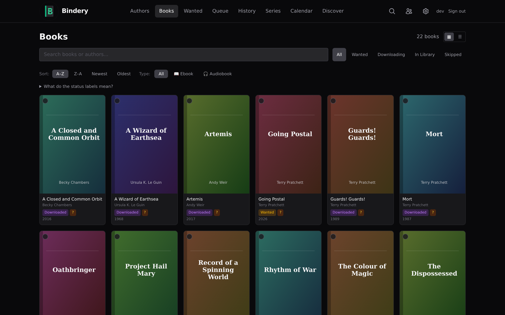
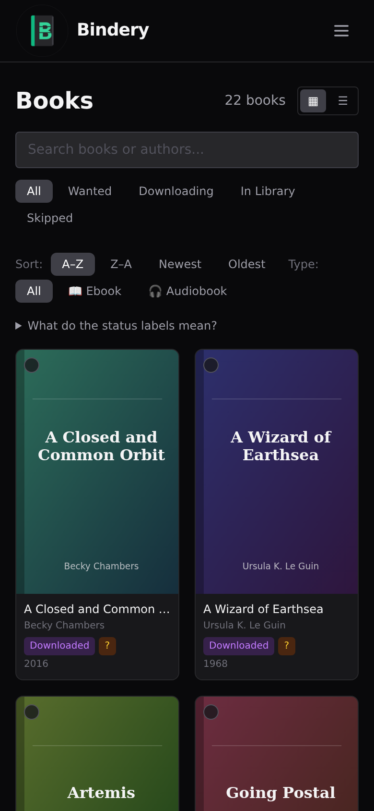
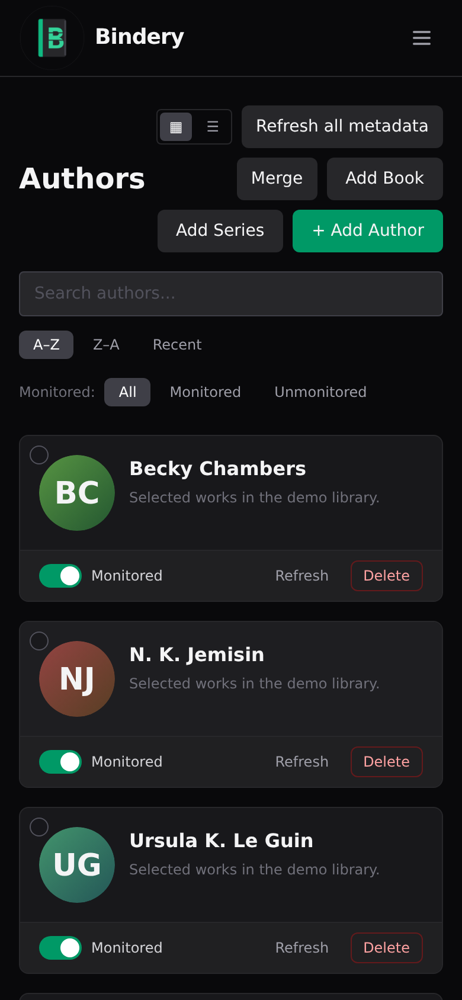
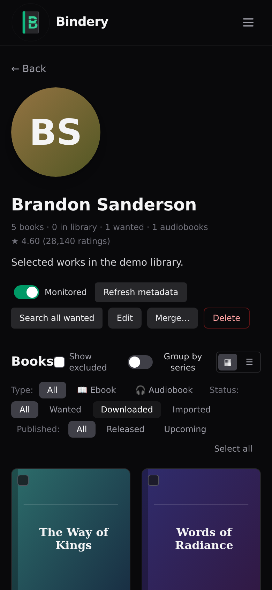

<p align="center">
  
</p>

<h1 align="center">Bindery</h1>

<p align="center">
  <strong>Automated book download manager for Usenet & Torrents</strong><br>
  Monitor authors. Search indexers. Download. Organize. Done.
</p>

<p align="center">
  <a href="https://github.com/vavallee/bindery/actions/workflows/ci.yml"></a>
  <a href="https://codecov.io/gh/vavallee/bindery"></a>
  <a href="https://github.com/vavallee/bindery/releases"></a>
  <a href="https://github.com/vavallee/bindery/pkgs/container/bindery"></a>
  <a href="https://goreportcard.com/report/github.com/vavallee/bindery"></a>
  <a href="https://github.com/vavallee/bindery/blob/main/LICENSE"></a>
  <a href="https://discord.gg/RpuYYRM9cZ"></a>
</p>

---

<!-- Hero: Books library — auto-switches between dark and light to match the viewer's OS theme -->
<p align="center">
  <picture>
    <source media="(prefers-color-scheme: dark)" srcset="docs/screenshots/books-desktop-dark.png">
    <source media="(prefers-color-scheme: light)" srcset="docs/screenshots/books-desktop-light.png">
    
  </picture>
</p>

<p align="center">
  <picture>
    <source media="(prefers-color-scheme: dark)" srcset="docs/screenshots/authors-desktop-dark.png">
    <source media="(prefers-color-scheme: light)" srcset="docs/screenshots/authors-desktop-light.png">
    
  </picture>
</p>

<p align="center">
  <picture>
    <source media="(prefers-color-scheme: dark)" srcset="docs/screenshots/author-detail-desktop-dark.png">
    <source media="(prefers-color-scheme: light)" srcset="docs/screenshots/author-detail-desktop-light.png">
    
  </picture>
</p>

<h4 align="center">Mobile-friendly</h4>

<p align="center">
  <picture>
    <source media="(prefers-color-scheme: dark)" srcset="docs/screenshots/books-mobile-dark.png">
    <source media="(prefers-color-scheme: light)" srcset="docs/screenshots/books-mobile-light.png">
    
  </picture>
  &nbsp;&nbsp;&nbsp;
  <picture>
    <source media="(prefers-color-scheme: dark)" srcset="docs/screenshots/authors-mobile-dark.png">
    <source media="(prefers-color-scheme: light)" srcset="docs/screenshots/authors-mobile-light.png">
    
  </picture>
  &nbsp;&nbsp;&nbsp;
  <picture>
    <source media="(prefers-color-scheme: dark)" srcset="docs/screenshots/author-detail-mobile-dark.png">
    <source media="(prefers-color-scheme: light)" srcset="docs/screenshots/author-detail-mobile-light.png">
    
  </picture>
</p>

---

## Why Bindery?

**Readarr is dead.** The official project was archived in June 2025 and its metadata backend (`api.bookinfo.club`) is permanently offline. Community forks rely on fragile Goodreads scrapers that break regularly. There was no reliable, open-source tool for automated book management on Usenet.

**Bindery is the clean-room replacement.** Built from scratch in Go with a modern React UI, Bindery uses only stable, documented public APIs for book metadata. No scraping. No dead backends. No fragile dependencies.

## Features

### Library management
- **Author monitoring** — Add authors and Bindery tracks all their works automatically via OpenLibrary's author works endpoint
- **Book tracking** — Per-book monitor toggle, status workflow (wanted → downloading → downloaded → imported)
- **Dual-format books** — Each book can hold an ebook *and* an audiobook simultaneously. The Book Detail page has separate format panels with independent status, file path, and grab buttons. The search pipeline uses Newznab category 7020 for ebooks and 3030 for audiobooks; the importer moves whole audiobook folders (multi-part `.m4b` / `.mp3`) as one unit into a separate audiobook library root; the Wanted page lists each missing format as a separate row.
- **Series support** — Books grouped by series with position tracking and dedicated Series page
- **Edition tracking** — Multiple editions per work, with format, ISBN, publisher, page count
- **Library scan** — Walk `/books/` and reconcile existing files with wanted books in the database; trigger on-demand from **Settings → General → Scan Library**. Matching is four-tier: ASIN → title + author → series name + position number → fuzzy title. Files annotated with series info (e.g. `[Mistborn, Book 1]` or `(Dune Chronicles #2)`) are matched even when the title alone would be ambiguous.
- **Author aliases** — Merge duplicate authors ("RR Haywood" / "R.R. Haywood" / "R R Haywood") into one canonical row from the Authors page; add-author flow detects aliases and prompts for merge instead of silently ingesting a duplicate

### Search & downloads
- **Newznab + Torznab** — Query multiple Usenet and torrent indexers in parallel, deduplicated and ranked
- **SABnzbd, NZBGet, qBittorrent, Transmission, Deluge** — Full support for both Usenet and torrent download clients. All clients support **Use SSL** and **URL Base** for connections through a reverse-proxy subpath (configure under **Settings → Download Clients**).
- **Auto-grab** — Scheduler searches for wanted books every 12h and automatically grabs the best result. Adding a new author or flipping a book to `wanted` fires an immediate search — no waiting for the next scheduled pass. Toggle the global kill-switch at **Settings → General → Auto-grab** to pause all automatic grabbing without losing your monitored list.
- **Interactive search** — Manual per-book search from the Wanted page with full result details; Grab button shows a spinner while in-flight and a ✓ on success. Author Detail page has a **Search all wanted** button to queue bulk searches for all monitored wanted books for that author in one click.
- **Smart matching** — Four-tier query fallback (`t=book` → `surname+title` → `author+title` → title); word-boundary keyword matching; contiguous-phrase requirement for multi-word titles; dual-author-anchor for ambiguous short titles; subtitle-aware (`Title: Subtitle`)
- **Composite ranking** — Results scored by format quality, edition tags (RETAIL / UNABRIDGED / ABRIDGED), year match to the book's release year, grab count, size, and ISBN exact-match bonus
- **Quality profiles** — Preference order for EPUB / MOBI / AZW3 / PDF, with cutoff rules
- **Language filter** — Preferred language setting (English by default); filters releases with foreign-language tags at word boundaries
- **Custom formats** — Regex-based release scoring for freeleech, retail tags, etc.
- **Delay profiles** — Wait N hours before grabbing to let higher-quality releases appear
- **Blocklist** — Consulted on every search and auto-grab; prevents re-grabbing releases you've rejected. Add entries directly from History with one click
- **Failure visibility** — Download errors surfaced in Queue (active) and History (permanent)

### Import & organize
- **Automatic import** — Completed downloads matched by NZO ID, placed in library with configurable naming template
- **Import modes** — **Move** (default): source deleted after import. **Copy**: source kept so torrent clients continue seeding. **Hardlink**: zero extra disk, both paths share an inode (download dir and library must be on the same filesystem). Configurable under **Settings → General → Import Mode**.
- **Naming tokens** — `{Author}`, `{SortAuthor}`, `{Title}`, `{Year}`, `{Series}`, `{SeriesNumber}`, `{ext}` with sanitized path components. `{Series}` expands to the book's primary series name (e.g. `Mistborn`); `{SeriesNumber}` to its position (e.g. `1` or `3.5`). Both silently expand to nothing for books not in a series, so the path collapses cleanly.
- **Cross-filesystem moves** — Atomic rename when possible, copy+verify+delete for NFS/separate volumes
- **History** — Every grab, import, and failure recorded with full detail (shown inline on History page)
- **Calibre library integration** — Three modes, all configurable under **Settings → Calibre**:
  - **Off** — no Calibre interaction (default).
  - **calibredb CLI** — every successful import calls `calibredb add --with-library <path>`; the returned Calibre book id is persisted on the Bindery book row.
  - **Plugin bridge** — POSTs the imported file path to the [Bindery Bridge plugin](https://github.com/vavallee/bindery-plugins) running an HTTP server inside a separate Calibre container; no shared binary or sidecar required. See [docs/CALIBRE-PLUGIN.md](docs/CALIBRE-PLUGIN.md) for setup.
  - **Library import** — read an existing Calibre library's `metadata.db` directly and ingest it as Bindery's catalogue (idempotent; trigger from the Settings page or set `calibre.sync_on_startup`). Toggling the mode takes effect without a restart.

### Metadata
- **OpenLibrary** (primary) — Authors, books, editions, covers, ISBN lookup
- **Google Books** (enricher) — Richer descriptions and ratings
- **Hardcover.app** (enricher) — Community ratings and series data via GraphQL
- **DNB** (enricher) — Deutsche Nationalbibliothek via the public SRU endpoint. No API key. Always on. Fills description, language, year, and publisher from MARC21 records — especially useful for German-language titles where OpenLibrary coverage is thin.
- **Audnex** — Audiobook narrator, duration, cover, and description by Audible ASIN via the free [api.audnex.us](https://api.audnex.us) wrapper. Trigger with `POST /api/v1/book/{id}/enrich-audiobook`.
- **Audible catalogue** — Direct author lookup against Audible's public catalogue endpoint. Supplements OpenLibrary/Hardcover during `FetchAuthorBooks` when the author's effective media type is `audiobook` or `both`. Pulled books carry the ASIN and flow through the same `allowed_languages` filter as the OpenLibrary path — prolific authors (Sanderson, King, Rowling) gain the ASINs that OL/Hardcover are missing, without letting foreign-language editions slip past the default profile.
- **Cover image proxy** — Cover images are fetched and cached server-side under `<dataDir>/image-cache/` (30-day TTL). All `imageURL` fields in API responses are rewritten to `/api/v1/images?url=<encoded>` before leaving the server. The browser never contacts Goodreads, OpenLibrary, or Google Books directly — no IP leakage, no third-party tracking.
- No Goodreads scraping. All sources use documented, stable public APIs.

### Discover
- **Recommendations engine** — The **Discover** page generates personalised book suggestions from multiple signals: next books in series you're reading, new releases from monitored authors, genre-similar titles (requires ≥ 20 books in library), OpenLibrary subject-based popular picks, and Hardcover.app wishlist cross-reference.
- **Taste profile** — Built from your downloaded/imported books: preferred genres, era, language, authors, and series. Recency scoring is relative to the median publication year of your library rather than the current year, so backlist readers aren't penalised.
- **Discover filters** — Candidates are hard-filtered: already-owned, dismissed, excluded-author, wrong-language, fewer-than-50-ratings, sub-3.0-rated, and collection/omnibus titles are all suppressed. Only individual, reasonably-rated books reach the page.
- **Dismiss / exclude** — Mark a recommendation as "not interested" or exclude an author entirely from future suggestions. Dismissals persist across engine runs.

### Migration
- **CSV import** — Upload a newline-separated list of author names (or a `name,monitored,searchOnAdd` CSV); each name is resolved against OpenLibrary.
- **Readarr import** — Upload `readarr.db` directly. Authors are re-resolved via OpenLibrary (Goodreads IDs aren't portable since `bookinfo.club` is dead); Indexers, download clients, and blocklist entries port structurally. Run a library scan afterward to match existing files.
- **CLI** — `bindery migrate csv <path>` and `bindery migrate readarr <path>` for first-time bulk imports without opening the UI.
- **UI** — Settings → Import tab with file upload + per-section result summary.

### Operations
- **Webhook notifications** — Configurable HTTP callbacks for grab / import / failure events (pipe to Apprise, ntfy, Home Assistant, etc.)
- **Metadata profiles** — Filter books by language, popularity, page count, ISBN presence
- **Import lists** — Auto-add authors/books from external sources; exclusion list to skip unwanted entries
- **Tag system** — Scope indexers/profiles/notifications to specific authors
- **Backup/restore** — Snapshot the SQLite database on demand
- **Log viewer** — Settings → Logs persists entries to the database and survives restarts. Filterable by date range, level, component, and full-text search. Retention period defaults to 14 days and is configurable. Runtime log level switchable to DEBUG without restarting via `PUT /api/v1/system/loglevel`
- **Authentication** — First-run setup creates an admin account (argon2id password hashing, signed session cookies). Four modes: **Enabled** (always require login), **Local only** (bypass auth for private IPs — home network convenience), **Disabled** (no auth, trusted network only), **Proxy** (trust an upstream `X-Forwarded-User` header from a configured trusted proxy — drop-in for Authelia / Authentik / oauth2-proxy forward-auth). Per-account API key for external integrations. Per-IP rate limiting on the login endpoint (thresholds configurable via `BINDERY_RATE_LIMIT_MAX_FAILURES` / `BINDERY_RATE_LIMIT_WINDOW_MINUTES`). CSRF double-submit tokens harden browser mutations (API-key clients exempt).
- **Arr-compatible queue API** — `GET /api/queue` exposes a Sonarr/Radarr-style queue payload for external tools such as [Harpoon](https://github.com/harpoon-io/harpoon). Returns `totalRecords`, per-record live size/sizeleft, status, client name, remote ID, and protocol. Supports pagination and sort. API-key authentication required; browser-session CSRF protections do not apply to this endpoint.
- **OIDC single sign-on** — Native Authorization Code + PKCE client with multi-provider support. Pre-configured for Google, GitHub (via Dex), Authelia, and Keycloak; any compliant IdP works. Users identified by stable `(issuer, sub)` — safe against email/username changes. Managed under Settings → Authentication.
- **Multi-user mode** — Per-user libraries, monitored authors, profiles, and downloads. Admin role manages indexers, download clients, and users; standard users see only their own catalogue. Users can be created locally, auto-provisioned via OIDC, or forward-auth mapped by username. Admin password reset from the Users page.

### UI
- **Multilingual UI** — English, French, German, Dutch, Spanish, Filipino (Tagalog), and Indonesian. Language auto-detected from the browser; manual override in Settings → General → Language. Persists to `localStorage` so the first paint is always in the right language.
- **Light and dark themes** — iOS-style slider toggle in Settings → General → Appearance. First-load default respects the browser's `prefers-color-scheme`; preference persists to localStorage.
- **Modern React SPA** — React 19 + TypeScript + Tailwind CSS 3, built with Vite.
- **Detail pages** — Routed `/book/:id` and `/author/:id` pages replace the previous modal flow. Deep-linkable, back-button friendly, hold per-book history inline.
- **Grid / Table view toggle** — Switch between poster-grid and dense-table views on the Books and Authors pages; choice persists per page.
- **Mobile-friendly** — Responsive layout with hamburger nav, card views for History/Blocklist, agenda view for Calendar. Table views hide less-critical columns on narrow viewports.
- **Pagination everywhere** — First/Prev/Next/Last + page numbers + configurable page size on all list pages; page size persists per-page in `localStorage`
- **Search, filter, sort** — On Authors, Books, Wanted, and History pages. Authors can be filtered by `Monitored / Unmonitored`. Author detail page sorts books by publication date and filters by type, status, or released/upcoming. Books filter chips include `Type: Ebook / Audiobook`; Books view shows the author inline.
- **Calendar view** — Upcoming book releases from monitored authors, with compact dot-indicator grid on mobile
- **Full REST API** — Every feature accessible via HTTP for scripting and integration
- **OPDS 1.2 catalogue at `/opds/v1.2/`** — browse and download your library from KOReader, Moon+ Reader, or any OPDS-capable reading app without Calibre. Authenticated with HTTP Basic Auth (any username, API key as password). Feeds: catalog root, recent, by author, search.

### Packaging
- **Single binary** — Frontend embedded via `go:embed`. No nginx, no sidecars, no complexity
- **Distroless Docker image** — Minimal attack surface, published to GHCR
- **Kubernetes-ready** — Helm chart included for ArgoCD / Flux deployments
- **SQLite + WAL** — Pure Go driver (`modernc.org/sqlite`), no CGO, no external database to manage

## Quick Start

### Docker

```bash
docker run -d \
  --name bindery \
  -p 8787:8787 \
  -v /path/to/config:/config \
  -v /path/to/books:/books \
  -v /path/to/downloads:/downloads \
  ghcr.io/vavallee/bindery:latest
```

Open <http://localhost:8787>, follow the first-run setup to create the admin account, and you're in.

### Binary (Linux / macOS / Windows)

Download the archive for your platform from the [latest release](https://github.com/vavallee/bindery/releases/latest), extract, and run:

```bash
# Linux / macOS
tar -xzf bindery_<version>_<os>_<arch>.tar.gz
./bindery
```

```cmd
:: Windows
:: Unzip bindery_<version>_windows_amd64.zip, then:
bindery.exe
```

On first run the database lands in the platform's standard location:

| Platform | Default `BINDERY_DB_PATH` | Default `BINDERY_DATA_DIR` |
|----------|---------------------------|----------------------------|
| Linux / Docker / Helm | `/config/bindery.db` | `/config` |
| Windows | `%APPDATA%\Bindery\bindery.db` | `%APPDATA%\Bindery` |
| macOS | `~/Library/Application Support/Bindery/bindery.db` | `~/Library/Application Support/Bindery` |

Set `BINDERY_DB_PATH` / `BINDERY_DATA_DIR` if you want them elsewhere. The resolved paths are logged at startup (`"starting bindery"` log line).

For Docker Compose, Kubernetes (Helm), running as a specific UID/GID, and upgrade notes, see **[docs/DEPLOYMENT.md](docs/DEPLOYMENT.md)**.

## Configuration

Bindery is configured through the web UI under **Settings**. Core env vars:

| Variable | Default | Description |
|----------|---------|-------------|
| `BINDERY_PORT` | `8787` | HTTP server port |
| `BINDERY_DB_PATH` | platform-dependent (see [Binary install](#binary-linux--macos--windows)) | SQLite database path |
| `BINDERY_DATA_DIR` | platform-dependent (see [Binary install](#binary-linux--macos--windows)) | Config directory (backups live here) |
| `BINDERY_LOG_LEVEL` | `info` | `debug` / `info` / `warn` / `error` |
| `BINDERY_DOWNLOAD_DIR` | `/downloads` | Where the download client places completed downloads |
| `BINDERY_LIBRARY_DIR` | `/books` | Destination for imported ebook files |
| `BINDERY_AUDIOBOOK_DIR` | falls back to `BINDERY_LIBRARY_DIR` | Destination for imported audiobook folders |
| `BINDERY_ENHANCED_HARDCOVER_API` | `false` | Enables Hardcover-token-backed series search, linking, catalog diffs, and missing-book fill when also enabled in Settings |

The full variable reference (path remapping, API key seeding, `BINDERY_PUID` / `BINDERY_PGID` sanity checks) is in **[docs/DEPLOYMENT.md](docs/DEPLOYMENT.md#environment-variables)**.

## Metadata Sources

Bindery aggregates book metadata from multiple open sources:

| Source | Auth Required | Used For |
|--------|---------------|----------|
| [OpenLibrary](https://openlibrary.org) | None | Primary: authors, books, editions, covers, ISBN lookup |
| [Google Books](https://developers.google.com/books) | API key (free) | Enrichment: descriptions, ratings |
| [Hardcover.app](https://hardcover.app) | None (public GraphQL) | Enrichment: community ratings, series |
| [DNB](https://www.dnb.de/EN/Professionell/Metadatendienste/Datenbezug/SRU/sru_node.html) | None (public SRU) | Enrichment: descriptions, language, year for German-language titles |
| [Audnex](https://api.audnex.us) | None | Audiobook narrator, duration, cover, description by ASIN |
| [Audible](https://audible.com) | None | Supplemental audiobook author lookup — pulls ASINs OpenLibrary/Hardcover miss |

No Goodreads scraping. All sources use documented, stable public APIs. Cover images are fetched and cached server-side (`GET /api/v1/images`) — the browser never contacts external image hosts directly.

## Supported Integrations

### Download clients
- **SABnzbd** — full support (NZB submission, queue/history polling, pause/resume/delete)
- **NZBGet** — JSON-RPC v2 (NZB submission, queue/history polling, remove)
- **qBittorrent** — WebUI API v2 with Username/Password auth (add magnet/URL, list/delete torrents)
- **Transmission** — RPC API with Username/Password auth (add magnet/URL, list/delete torrents)
- **Deluge** — JSON-RPC with cookie auth (add magnet/URL, list/delete torrents)

All clients support **Use SSL** (HTTPS) and **URL Base** (reverse-proxy subpath). Configure both under **Settings → Download Clients**.

### Indexers
- **Newznab** (Usenet) — NZBGeek, NZBFinder, NZBPlanet, DrunkenSlug, etc.
- **Torznab** (Torrents) — Prowlarr, Jackett, or direct Torznab endpoints
- **Configurable categories per indexer** — set custom Newznab category IDs in Settings → Indexers (e.g. `7120` for German books, `3130` for German audio on SceneNZBs). Bindery routes 7xxx IDs to ebook searches and 3xxx IDs to audiobook searches automatically.

### Notifications
- **Generic webhooks** — Any HTTP endpoint. Pipe to Apprise, ntfy, Home Assistant, Slack, Discord via proxies.

## Architecture

Bindery is a single Go binary with the React frontend embedded via `go:embed`:

```
   Newznab / Torznab
      indexers
         │
         ▼
┌────────────────────────────┐
│         Bindery            │──► SABnzbd / NZBGet / qBittorrent / Transmission / Deluge
│  Go backend + React SPA    │──► /books/ library
│  SQLite (WAL mode)         │──► Webhook notifications
└────────────────────────────┘
    ▲                    ▲
    │                    │
OpenLibrary      Google Books, Hardcover.app, DNB
 (primary)                 (enrichers)
```

- **Backend:** Go 1.25 with [chi](https://github.com/go-chi/chi) router
- **Database:** SQLite via [modernc.org/sqlite](https://pkg.go.dev/modernc.org/sqlite) (pure Go, no CGO)
- **Frontend:** React 19 + TypeScript + Tailwind CSS + [Vite](https://vite.dev)
- **Container:** Multi-stage build on [distroless](https://github.com/GoogleContainerTools/distroless) (minimal attack surface)

## API

Bindery exposes a full REST API under `/api/v1`. A few highlights:

```
GET    /api/v1/health                    - server health
GET    /api/v1/author                    - list authors
POST   /api/v1/author                    - add author (triggers async book fetch)
GET    /api/v1/book?status=wanted        - filter books by status
POST   /api/v1/book/{id}/search          - manual indexer search for a book
GET    /api/v1/queue                     - active downloads with live downloader overlay
POST   /api/v1/queue/grab                - submit a search result to download client
GET    /api/queue                        - *arr-compatible queue for external tools
GET    /api/v1/history                   - grab/import/failure events
POST   /api/v1/history/{id}/blocklist    - add a history event's release to the blocklist
GET    /api/v1/blocklist                 - blocked releases
GET    /api/v1/images?url=<encoded>      - proxied + cached cover image (30-day TTL)
POST   /api/v1/notification/{id}/test    - fire a test webhook
POST   /api/v1/backup                    - snapshot the database
```

### Authentication

Every request to `/api/v1/*` (except `/health`, `/auth/status`, `/auth/login`, `/auth/logout`, `/auth/setup`) is authenticated. A request is allowed if **any** of:

- Auth mode is **Disabled**.
- Auth mode is **Local only** and the request originates from a private-range IP (`10/8`, `172.16/12`, `192.168/16`, `127/8`, IPv6 ULA, link-local, loopback).
- A valid `X-Api-Key` header (or `?apikey=` query param) matches the stored key.
- A valid `bindery_session` cookie is present.

Otherwise the server responds with `401`. The API key lives in **Settings → General → Security** — copy it from there for scripts and integrations. Regenerating the key invalidates any existing consumers.

## Documentation

| Topic | Where |
|-------|-------|
| **Quickstart** — first author to first grab in 10 minutes | [Wiki](https://github.com/vavallee/bindery/wiki/Quickstart) |
| **Deployment** — Docker, Compose, k8s/Helm, binary, UID/GID, upgrades | [docs/DEPLOYMENT.md](docs/DEPLOYMENT.md) |
| **ABS import** — setup, path remap, review queue, rollback, and matching behavior | [docs/abs_import.md](docs/abs_import.md) |
| **Enhanced Hardcover series** — token setup, series linking, catalog diffs, and missing-book fill | [docs/Hardcover-Series-Wiki.md](docs/Hardcover-Series-Wiki.md) |
| **Calibre plugin bridge** — cross-container Calibre integration via the Bindery Bridge plugin | [docs/CALIBRE-PLUGIN.md](docs/CALIBRE-PLUGIN.md) |
| **Roadmap** — planned work, scope notes, and explicitly-out-of-scope items (Z-Library, OpenBooks, etc.) | [docs/ROADMAP.md](docs/ROADMAP.md) |
| **Contributing & CI checks** — dev setup, full quality/security matrix, local check suite | [CONTRIBUTING.md](CONTRIBUTING.md) |
| **Changelog** — release notes | [CHANGELOG.md](CHANGELOG.md) |
| **Reverse-proxy & SSO setups** — Traefik / Caddy / Nginx / Authelia / Authentik recipes | [Wiki](https://github.com/vavallee/bindery/wiki/Reverse-proxy-and-SSO) |
| **Troubleshooting** — permission-denied, path-remap, import failures | [Wiki](https://github.com/vavallee/bindery/wiki/Troubleshooting) |
| **Indexer & download-client recipes** — NZBGeek / DrunkenSlug / Prowlarr / Jackett / SAB / qBit tips | [Wiki](https://github.com/vavallee/bindery/wiki/Indexer-and-downloader-recipes) |
| **Migrating from Readarr** — step-by-step with known failure modes | [Wiki](https://github.com/vavallee/bindery/wiki/Migrating-from-Readarr) |

## Community

- **Discord** — real-time help, setup questions, release chat: [discord.gg/RpuYYRM9cZ](https://discord.gg/RpuYYRM9cZ). The `#support` channel is the best place to ask; `#changelog` is updated on every release.
- **GitHub Issues** — bug reports and feature requests: [issues](https://github.com/vavallee/bindery/issues).
- **GitHub Discussions** — open-ended design questions, show-and-tell, integration recipes: [discussions](https://github.com/vavallee/bindery/discussions).

Please keep security reports out of Discord and public issues — see [SECURITY.md](SECURITY.md) for the private disclosure channel.

## Security

Bindery holds API keys, reaches LAN services, and writes to disk. We take that
seriously.

<p>
  <a href="https://github.com/vavallee/bindery/security/code-scanning"></a>
  <a href="https://securityscorecards.dev/viewer/?uri=github.com/vavallee/bindery"></a>
  <a href="https://github.com/vavallee/bindery/security/dependabot"></a>
  <a href="SECURITY.md"></a>
</p>

Every push and every weekly cron runs gosec, govulncheck, Semgrep, gitleaks,
Trivy, Grype, Dockle, Syft, ZAP baseline, and OpenSSF Scorecard. Findings
upload to GitHub's Security tab as SARIF and are public-readable. Release
images ship with SLSA build provenance and Syft SBOMs.

Highlights of the in-app controls:

- **SSRF guards** on every outbound URL (webhooks, indexers, download clients), with DNS-rebinding defense.
- **Hardened headers** — CSP, `X-Frame-Options: DENY`, `Referrer-Policy`, auto HSTS when TLS is present.
- **Cookie `Secure` auto-detect** via TLS or `X-Forwarded-Proto`, overridable.
- **Distroless, non-root, read-only rootfs** container with all caps dropped and RuntimeDefault seccomp.
- **Digest-pinned base images** tracked by Dependabot.

To report a vulnerability, follow the process in **[SECURITY.md](SECURITY.md)**.
The full threat model, control catalogue, and verification recipes live on
the [wiki Security page](https://github.com/vavallee/bindery/wiki/Security).

## Telemetry

Bindery sends one anonymous ping per day to [getbindery.dev](https://getbindery.dev) so the maintainer can count active installs. The ping contains:

| Field | Value |
|---|---|
| `install_id` | Random UUID generated on first run, stored locally |
| `version` | Running binary version (e.g. `v1.4.1`) |
| `os` | `linux`, `darwin`, `windows` |
| `arch` | `amd64`, `arm64` |

No hostnames, IP addresses, library contents, or personal data are included. The server returns the latest published version, which Bindery uses for update notifications.

**To opt out:** set `telemetry.enabled` to `false` in **Settings → General**, or set the env var `BINDERY_TELEMETRY_DISABLED=true` before first run.

## Contributing

PRs, issues, and feedback welcome. See **[CONTRIBUTING.md](CONTRIBUTING.md)** for the dev setup, the full local check suite, and the PR flow. Tracked feature work lives in **[docs/ROADMAP.md](docs/ROADMAP.md)** — open an issue before starting anything substantial.

## License

MIT. See [LICENSE](LICENSE) for details.

## Acknowledgments

- The [*arr community](https://wiki.servarr.com/) for pioneering the monitor-search-download-import pattern
- [OpenLibrary](https://openlibrary.org) for free, open book metadata
- The Readarr project for the original vision, even though the implementation couldn't be sustained
